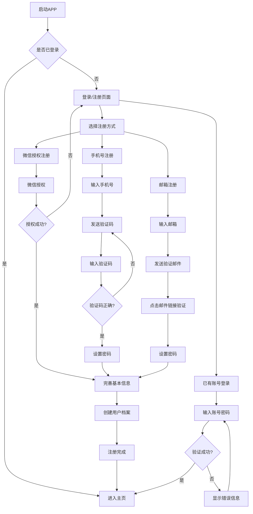
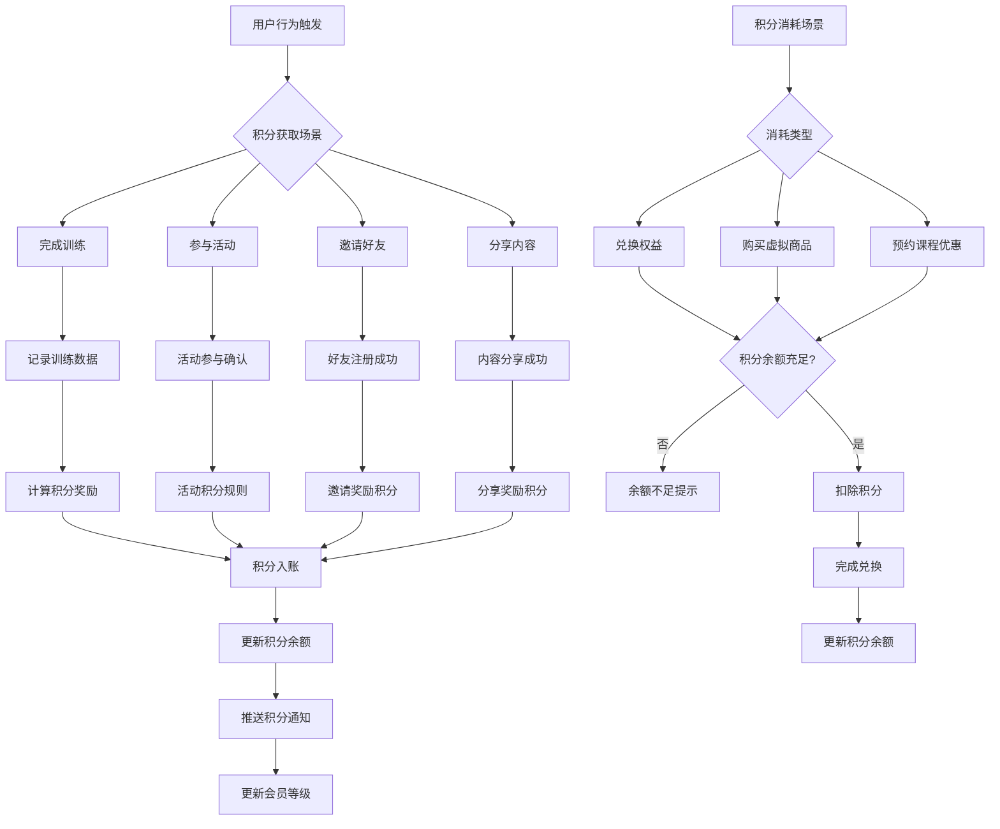
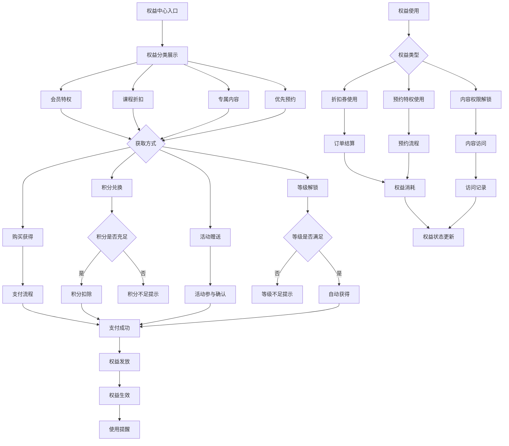
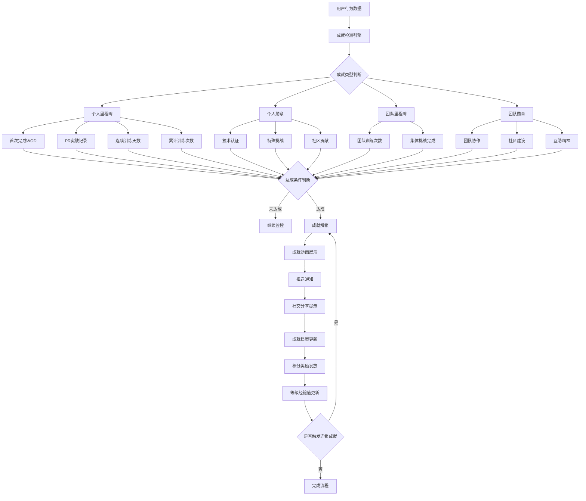
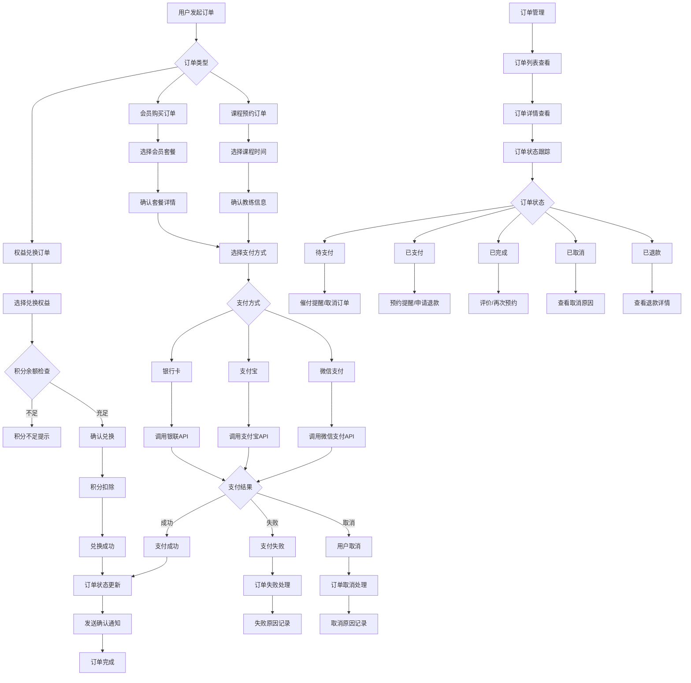
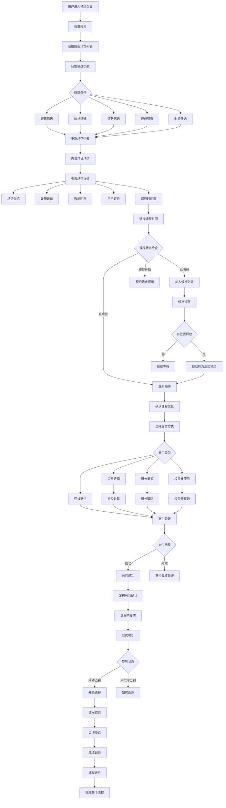
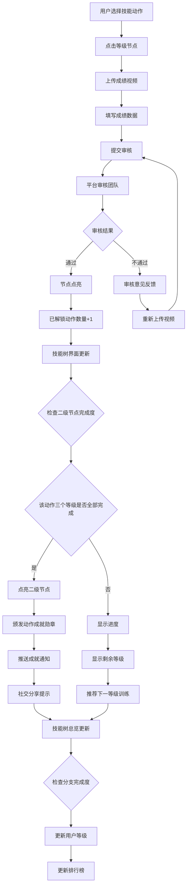
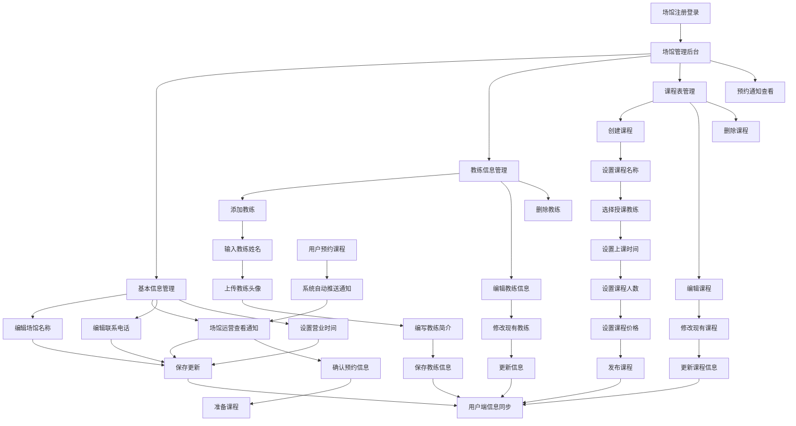
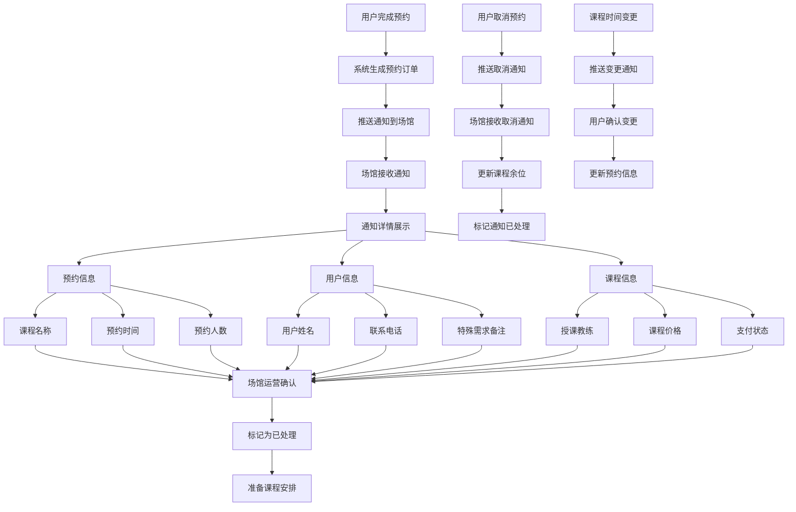

# MobiLiF拓练 功能流程图与详细PRD

## C端功能详细设计

---

## 4.1.1 用户管理

### 用户注册登录流程图



### 用户管理PRD

#### 功能概述
用户管理模块负责用户的注册、登录、信息管理等基础功能，支持多种注册方式，确保用户便捷安全地使用APP。

#### 核心功能

**1. 用户注册**
- **手机号注册**
  - 输入手机号 → 发送短信验证码 → 验证码校验 → 设置密码 → 完善信息
  - 验证码有效期：5分钟
  - 重发间隔：60秒
  - 密码要求：8-20位，包含字母和数字

- **邮箱注册**
  - 输入邮箱 → 发送验证邮件 → 点击邮件链接 → 设置密码 → 完善信息
  - 邮件有效期：24小时
  - 支持主流邮箱服务商

- **微信快速注册**
  - 微信授权 → 获取基本信息 → 绑定手机号(可选) → 创建账户
  - 自动获取头像、昵称
  - 支持微信登录和账号密码登录切换

**2. 用户登录**
- 账号密码登录
- 微信一键登录
- 记住登录状态(可选)
- 自动登录功能

**3. 用户信息管理**
- 基础信息：昵称、头像、性别、生日、所在城市
- 运动信息：CrossFit经验、技能水平、训练目标
- 身体数据：身高、体重、体脂率(可选)
- 隐私设置：信息可见范围、是否接受推送

**4. 账户安全**
- 修改密码
- 绑定/解绑手机号
- 绑定/解绑邮箱
- 注销账户

#### 界面设计要求
- 注册页面简洁，减少用户输入负担
- 支持手势快速切换登录方式
- 错误提示友好，提供解决建议
- 注册流程支持保存草稿，防止信息丢失

#### 技术规格
- 密码采用BCrypt加密存储
- 手机号脱敏显示
- 支持OAuth 2.0微信登录
- JWT Token管理会话

---

## 4.1.2 积分中心

### 积分获取消耗流程图



### 积分中心PRD

#### 功能概述
积分中心是用户激励体系的核心，通过积分获取和消耗机制，提升用户活跃度和平台粘性。

#### 积分获取规则

**1. 训练完成奖励**
- 首次完成训练：+50积分
- 每日训练打卡：+20积分
- 连续训练奖励：3天+30分，7天+100分，30天+500分
- PR突破奖励：+100积分
- 完成标准WOD：+30积分

**2. 社交互动奖励**
- 分享训练成果：+10积分
- 邀请好友注册：+200积分
- 好友首次训练：+50积分
- 发表训练心得：+15积分
- 获得点赞/评论：+5积分

**3. 平台活动奖励**
- 参与官方挑战：+50-200积分
- 完成任务：+20-100积分
- 节日活动：+100-500积分

#### 积分消耗场景

**1. 权益兑换**
- 会员折扣券：200积分
- 专属头像框：500积分
- 训练装备优惠券：1000积分
- 私教课程体验：2000积分

**2. 虚拟商品**
- 技能点加速：100积分
- 特殊勋章：300积分
- 个性化主题：500积分

**3. 课程优惠**
- 预约课程9折：50积分
- 预约课程8折：100积分
- VIP预约通道：200积分

#### 会员等级体系

**等级划分标准**
- **新手 (Bronze)**: 注册用户，0-499积分
- **进阶 (Silver)**: 活跃用户，500-1999积分
- **专家 (Gold)**: 资深用户，2000-4999积分
- **大师 (Platinum)**: 核心用户，5000-9999积分
- **传奇 (Diamond)**: 顶级用户，10000+积分

**等级特权**
- Bronze: 基础功能
- Silver: 预约优先级+1，专属客服
- Gold: 月度免费课程，生日特权
- Platinum: VIP预约通道，专属活动
- Diamond: 私人定制服务，品牌合作机会

#### 界面设计要求
- 积分变化实时显示，增加仪式感
- 等级进度条可视化
- 积分获取来源透明化
- 兑换商城分类清晰

---

## 4.1.3 权益中心

### 权益获取使用流程图



### 权益中心PRD

#### 功能概述
权益中心管理用户的各类特权和福利，包括获取、使用、过期管理等完整生命周期。

#### 权益分类体系

**1. 会员特权**
- VIP客服优先响应
- 专属用户标识
- 生日特别福利
- 会员专享活动邀请
- 数据分析报告

**2. 课程折扣**
- 单次课程折扣券（9折、8折、7折）
- 包月课程优惠
- 私教课程体验券
- 新场馆首次免费体验

**3. 专属内容**
- 高级训练视频
- 专业营养指导
- 伤病预防知识
- 大师课程回放
- 独家访谈内容

**4. 优先预约**
- 热门课程优先预约权
- 预约时间窗口提前
- 候补列表优先级
- 临时取消课程补偿

#### 获取渠道设计

**1. 直接购买**
- 单项权益购买
- 权益包组合购买
- 订阅制权益服务
- 限时特价活动

**2. 积分兑换**
- 固定积分兑换权益
- 积分+现金混合支付
- 会员专享兑换价格

**3. 活动赠送**
- 新用户注册礼包
- 节日限定权益
- 签到奖励权益
- 任务完成奖励

**4. 等级自动解锁**
- 达到特定会员等级自动获得
- 训练天数里程碑奖励
- 消费金额达标奖励

#### 权益管理功能

**1. 权益库存管理**
- 我的权益列表
- 有效期显示
- 使用状态跟踪
- 即将过期提醒

**2. 使用记录**
- 权益使用历史
- 节省金额统计
- 使用频率分析

**3. 分享功能**
- 权益分享给好友
- 团购权益活动
- 推荐奖励机制

#### 技术实现要点
- 权益状态实时同步
- 防重复使用机制
- 权益叠加规则引擎
- 自动过期处理

---

## 4.1.4 成就中心

### 成就解锁流程图



### 成就中心PRD

#### 功能概述
成就中心通过里程碑和勋章系统，记录用户的训练历程，激发持续参与动力，建立社区荣誉感。

#### 个人成就体系

**1. 里程碑成就**

*训练频次类*
- 初出茅庐：完成首次CrossFit训练
- 坚持不懈：连续训练7天
- 月度战士：单月训练20次
- 年度冠军：全年训练300次
- 铁人意志：连续训练100天

*技能突破类*
- 力量觉醒：深蹲PR达到体重1.5倍
- 爆发力王：抓举PR达到体重1.2倍
- 耐力之王：完成Murph挑战
- 体操大师：完成10个标准引体向上
- 全能战士：掌握50个不同动作

*数据记录类*
- 数据狂人：记录100次训练数据
- 进步神速：单月PR提升5次
- 持续改进：连续6个月保持进步

**2. 勋章成就**

*技术认证类*
- 举重专家：通过举重技术认证
- 体操达人：掌握高难度体操动作
- 心肺强者：达到优秀有氧能力标准

*特殊挑战类*
- 挑战者：参与官方月度挑战
- 探索者：在10个不同场馆训练
- 旅行者：在5个不同城市drop-in
- 夜猫子：完成10次晚间训练

*社区贡献类*
- 分享达人：分享50次训练内容
- 导师：帮助10个新手用户
- 评论家：发表100条有价值评论
- 网红：获得1000个点赞

#### 团队成就体系

**1. 团队里程碑**
- 团队初建：创建首个训练小组
- 团队壮大：小组成员达到10人
- 团队活跃：小组月度活跃度90%
- 团队冠军：小组在竞赛中获得冠军

**2. 团队勋章**
- 协作精神：完成团队配合训练
- 互助友爱：为队友提供帮助
- 领导力：担任团队队长并表现优秀
- 凝聚力：组织线下聚会活动

#### 成就展示系统

**1. 个人成就墙**
- 成就时间轴展示
- 稀有度标识
- 获得难度评级
- 完成度统计

**2. 社交分享**
- 成就解锁动态分享
- 成就对比功能
- 成就排行榜

**3. 激励机制**
- 成就预告系统
- 进度提醒
- 即将解锁提示

#### 技术实现要点
- 实时数据监控
- 防刷机制
- 成就回溯校验
- 分布式成就计算

---

## 4.1.5 订单中心

### 订单处理流程图



### 订单中心PRD

#### 功能概述
订单中心管理用户的所有交易记录，包括课程预约、会员购买、权益兑换等，提供完整的订单生命周期管理。

#### 订单类型管理

**1. 课程预约订单**
- 订单信息：课程名称、时间、教练、场馆、价格
- 状态流转：待支付→已支付→待参与→已完成→待评价
- 特殊处理：临时取消、教练调整、时间变更
- 退款规则：提前24小时可退款，2小时内不可退

**2. 会员购买订单**
- 订单信息：套餐类型、有效期、价格、优惠信息
- 状态流转：待支付→已支付→已生效→已过期
- 自动续费：到期前7天提醒，支持自动续费设置
- 退款规则：7天无理由退款，使用后按比例退费

**3. 权益兑换订单**
- 订单信息：权益名称、积分价格、兑换时间
- 状态流转：兑换中→兑换成功→已使用→已过期
- 特殊处理：积分退回、权益转赠

#### 支付系统集成

**1. 支付方式支持**
- 微信支付：扫码支付、APP支付
- 支付宝：快捷支付、扫码支付
- 银行卡：借记卡、信用卡
- 余额支付：账户余额、积分抵扣

**2. 支付安全**
- SSL加密传输
- 支付密码验证
- 风险控制系统
- 异常交易监控

**3. 支付结果处理**
- 成功：订单确认、权益发放、通知推送
- 失败：原因记录、重试机制、客服介入
- 超时：自动取消、库存释放

#### 订单管理功能

**1. 订单查询**
- 全部订单列表
- 按状态筛选
- 按时间范围筛选
- 按订单类型筛选
- 关键词搜索

**2. 订单详情**
- 基本信息展示
- 支付信息详情
- 物流跟踪（如适用）
- 操作按钮（取消、退款、评价等）

**3. 订单操作**
- 取消订单：未支付订单可直接取消
- 申请退款：符合条件的订单可申请退款
- 修改订单：支持时间、教练调整（限制条件）
- 再次购买：快速复制订单

#### 退款处理流程

**1. 退款申请**
- 在线提交退款申请
- 选择退款原因
- 上传相关凭证
- 客服审核处理

**2. 退款规则**
- 课程类：提前24小时全额退款，2小时内不可退
- 会员类：7天无理由退款，使用后按比例退费
- 权益类：一般不支持退款，特殊情况人工处理

**3. 退款状态跟踪**
- 申请提交→审核中→审核通过→退款处理中→退款完成

#### 发票管理

**1. 发票申请**
- 电子发票自动生成
- 纸质发票申请流程
- 发票抬头管理
- 税号信息维护

**2. 发票查询**
- 历史发票记录
- 发票下载功能
- 发票验真查询

#### 界面设计要求
- 订单状态清晰标识
- 操作按钮位置合理
- 支付流程简洁流畅
- 异常情况友好提示

---

## 4.1.6 场馆预约

### 场馆预约完整流程图



### 场馆预约PRD

#### 功能概述
场馆预约是APP的核心功能，为用户提供便捷的CrossFit场馆发现、课程预约、签到上课的完整服务流程，特别针对旅行drop-in场景优化。

#### 场馆发现功能

**1. 智能定位**
- GPS自动定位
- 手动输入地址
- 常用地址管理
- 多城市切换

**2. 场馆列表展示**
- 地图模式：直观显示场馆位置
- 列表模式：详细信息展示
- 距离排序：从近到远
- 综合排序：距离+评分+价格权重

**3. 高级筛选功能**
- 距离筛选：1km, 3km, 5km, 10km+
- 价格范围：¥50-80, ¥80-120, ¥120-200, ¥200+
- 评分筛选：4.0+, 4.5+, 5.0
- 设施筛选：停车位、淋浴间、储物柜、专业器械
- 时间筛选：营业时间、有空余课程
- 特色标签：新手友好、竞技训练、女性专场

#### 场馆详情页面

**1. 基础信息**
- 场馆名称、地址、联系方式
- 营业时间、交通指引
- 停车信息、周边设施
- 价格体系、会员政策

**2. 设施设备展示**
- 高清场馆照片轮播
- 器械设备清单
- 功能区域介绍
- 360°全景展示（高级功能）

**3. 教练团队**
- 教练个人简介
- 专业资质认证
- 教学风格标签
- 用户评价评分
- 课程时间安排

**4. 用户评价系统**
- 综合评分展示
- 分项评分：环境、教练、设备、服务
- 用户评论列表
- 照片评价展示
- 评价真实性验证

#### 课程预约系统

**1. 课程时间表**
- 周视图展示课程安排
- 实时余位显示
- 课程难度标识
- 教练信息显示
- 课程类型分类（WOD、举重、体操等）

**2. 预约流程优化**
- 一键快速预约
- 预约信息预填充
- 支付方式记忆
- 预约确认页面清晰

**3. 候补排队机制**
- 满员课程自动加入候补
- 候补位置实时显示
- 有位置释放时推送通知
- 候补转正自动确认选项

#### 支付与优惠系统

**1. 灵活支付方式**
- 单次付费：按课程付费
- 套餐购买：多次课程包
- 会员折扣：不同等级折扣
- drop-in价格：旅行用户特价

**2. 优惠券系统**
- 新用户首次免费体验
- 会员专享折扣券
- 节日限时优惠
- 推荐好友奖励

**3. 积分抵扣**
- 积分抵现功能
- 积分+现金组合支付
- 会员积分倍率加成

#### 签到上课流程

**1. 到店签到**
- 二维码扫描签到
- GPS位置验证
- 人脸识别签到（高级功能）
- 前台确认签到

**2. 课程参与**
- 课程开始推送
- 训练数据记录
- 实时成绩录入
- 教练点评记录

**3. 课程结束**
- 自动签退
- 成绩数据同步
- 卡路里消耗统计
- 技能经验值更新

#### 评价反馈系统

**1. 课程评价**
- 五星评分系统
- 多维度评价：教练、环境、课程内容、难度匹配
- 文字评价+图片上传
- 匿名评价选项

**2. 教练评价**
- 专业性评分
- 教学风格评价
- 互动性评分
- 推荐度调查

**3. 场馆综合评价**
- 设施设备评分
- 服务质量评分
- 性价比评分
- 再次光顾意愿

#### 特殊场景处理

**1. drop-in用户优化**
- 旅行模式切换
- 多城市场馆推荐
- 国际用户支持
- 语言障碍解决方案

**2. 紧急情况处理**
- 课程临时取消通知
- 教练临时更换
- 设备故障应急预案
- 恶劣天气预案

**3. 无障碍访问**
- 残障人士设施标识
- 特殊需求预约选项
- 无障碍路线指引

#### 数据分析与个性化

**1. 用户行为分析**
- 预约习惯分析
- 偏好场馆记录
- 训练时间规律
- 消费行为模式

**2. 个性化推荐**
- 基于历史的场馆推荐
- 相似用户的选择推荐
- 新场馆发现推荐
- 课程类型匹配推荐

#### 技术实现要点
- 实时库存管理系统
- 高并发预约处理
- 支付安全保障
- 数据实时同步
- 离线功能支持

---

## 4.1.7 技能树

### 技能解锁进阶流程图



### 技能树PRD

#### 功能概述
技能树系统将CrossFit训练体系结构化，通过视频成绩上传和审核机制，让用户逐步解锁技能节点，获得成就感和技能认证。

#### 技能分支体系

**1. 举重分支 (Olympic Lifting & Strength)**

*抓举 (Snatch)*
- **Lv1 新人基础**: 空杠抓举技术，重量15-30kg，标准动作完成
- **Lv2 标准**: 标准抓举技术，男性40-60kg，女性25-40kg
- **Lv3 进阶**: 高重量抓举，男性70kg+，女性45kg+

*翻站 (Clean)*
- **Lv1 新人基础**: 空杠翻站技术，重量20-40kg，标准动作完成
- **Lv2 标准**: 标准翻站技术，男性50-70kg，女性35-50kg
- **Lv3 进阶**: 高重量翻站，男性80kg+，女性55kg+

*挺举 (Jerk)*
- **Lv1 新人基础**: 架上挺举技术，重量20-40kg，标准动作完成
- **Lv2 标准**: 标准挺举技术，男性50-70kg，女性35-50kg
- **Lv3 进阶**: 高重量挺举，男性80kg+，女性55kg+

*背蹲 (Back Squat)*
- **Lv1 新人基础**: 标准背蹲技术，体重0.8-1倍
- **Lv2 标准**: 力量背蹲，体重1.2-1.5倍
- **Lv3 进阶**: 大重量背蹲，体重1.8倍以上

*前蹲 (Front Squat)*
- **Lv1 新人基础**: 标准前蹲技术，体重0.6-0.8倍
- **Lv2 标准**: 力量前蹲，体重1-1.2倍
- **Lv3 进阶**: 大重量前蹲，体重1.5倍以上

*卧推 (Bench Press)*
- **Lv1 新人基础**: 标准卧推技术，体重0.6-0.8倍
- **Lv2 标准**: 力量卧推，体重1-1.2倍
- **Lv3 进阶**: 大重量卧推，体重1.5倍以上

*硬拉 (Deadlift)*
- **Lv1 新人基础**: 标准硬拉技术，体重1-1.2倍
- **Lv2 标准**: 力量硬拉，体重1.5-1.8倍
- **Lv3 进阶**: 大重量硬拉，体重2.2倍以上

**2. 体操分支 (Gymnastics)**

*引体向上 (Pull-ups)*
- **Lv1 新人基础**: 标准引体向上1-5个
- **Lv2 标准**: 连续引体向上10-15个
- **Lv3 进阶**: 连续引体向上20个以上或负重引体

*脚触杠 (Toes to Bar)*
- **Lv1 新人基础**: 悬垂举腿到90度，5-10个
- **Lv2 标准**: 标准脚触杠，10-15个连续
- **Lv3 进阶**: 快速脚触杠，20个以上连续

*单杠双力臂 (Bar Muscle-ups)*
- **Lv1 新人基础**: 辅助或跳跃单杠双力臂，1-3个
- **Lv2 标准**: 标准单杠双力臂，5-8个连续
- **Lv3 进阶**: 快速单杠双力臂，10个以上或负重

*吊环双力臂 (Ring Muscle-ups)*
- **Lv1 新人基础**: 辅助吊环双力臂，1-2个
- **Lv2 标准**: 标准吊环双力臂，3-5个连续
- **Lv3 进阶**: 快速吊环双力臂，8个以上

*倒立 (Handstand)*
- **Lv1 新人基础**: 靠墙倒立30秒以上
- **Lv2 标准**: 自由倒立30秒以上
- **Lv3 进阶**: 自由倒立60秒以上或单手倒立

*倒立撑 (Handstand Push-ups)*
- **Lv1 新人基础**: 靠墙倒立撑5-10个
- **Lv2 标准**: 标准倒立撑8-12个
- **Lv3 进阶**: 自由倒立撑或高难度变式

*倒立走 (Handstand Walk)*
- **Lv1 新人基础**: 倒立行走5-10米
- **Lv2 标准**: 倒立行走20米以上
- **Lv3 进阶**: 倒立行走50米以上或障碍倒立走

**3. 体能分支 (Conditioning)**

*墙球 (Wall Ball)*
- **Lv1 新人基础**: 6kg球，连续50个标准动作
- **Lv2 标准**: 9kg球，连续100个标准动作
- **Lv3 进阶**: 12kg球，连续150个或高强度组合

*跑步 (Running)*
- **Lv1 新人基础**: 5km完成，配速6:30/km以内
- **Lv2 标准**: 10km完成，配速6:00/km以内
- **Lv3 进阶**: 半马完成，配速5:30/km以内

*划船 (Rowing)*
- **Lv1 新人基础**: 2000m划船，9:00以内完成
- **Lv2 标准**: 2000m划船，8:00以内完成
- **Lv3 进阶**: 2000m划船，7:30以内完成

*滑雪 (Ski Erg)*
- **Lv1 新人基础**: 1000m滑雪，4:30以内完成
- **Lv2 标准**: 1000m滑雪，4:00以内完成
- **Lv3 进阶**: 1000m滑雪，3:40以内完成

*风阻自行车 (Assault Bike)*
- **Lv1 新人基础**: 1000卡路里，45分钟以内完成
- **Lv2 标准**: 1000卡路里，40分钟以内完成
- **Lv3 进阶**: 1000卡路里，35分钟以内完成

*波比 (Burpees)*
- **Lv1 新人基础**: 连续50个标准波比
- **Lv2 标准**: 连续100个标准波比
- **Lv3 进阶**: 连续150个或高强度波比变式

*跳箱 (Box Jump)*
- **Lv1 新人基础**: 50cm跳箱，连续50个
- **Lv2 标准**: 60cm跳箱，连续100个
- **Lv3 进阶**: 75cm跳箱，连续100个或高难度变式

#### 节点解锁机制

**1. 视频上传系统**

*上传要求*
- 视频时长：30秒-2分钟
- 清晰度要求：720P以上
- 角度要求：能清晰看到完整动作
- 音频要求：可选，用于计数或教练指导

*成绩数据录入*
- 重量类：精确到0.5kg
- 次数类：精确到个数
- 时间类：精确到秒
- 距离类：精确到米

**2. 审核机制**

*审核团队*
- 认证教练审核员
- 技术动作专家
- 视频质量检查员

*审核标准*
- 动作标准性：符合CrossFit官方标准
- 成绩真实性：重量、次数、时间准确
- 视频完整性：无剪辑、无作弊
- 安全性评估：动作执行安全规范

*审核时效*
- 标准审核：48小时内完成
- 争议案例：72小时内专家会审
- 申诉处理：7个工作日内终审

**3. 节点状态管理**

*节点状态*
- **未解锁**：灰色显示，显示解锁条件
- **审核中**：黄色显示，显示审核进度
- **已点亮**：绿色显示，显示完成时间
- **争议中**：橙色显示，等待复审

*进度显示*
- 单个动作完成度：Lv1/Lv2/Lv3进度条
- 二级节点完成度：7个动作完成情况
- 一级分支完成度：整体分支进度
- 总体技能树完成度：全部技能统计

#### 成就奖励系统

**1. 单项成就**

*节点点亮奖励*
- 积分奖励：Lv1(+50分)，Lv2(+100分)，Lv3(+200分)
- 经验值：技能经验+10/20/50
- 称号碎片：收集碎片合成称号

*二级节点完成奖励*
- 动作徽章：专属动作掌握徽章
- 大额积分：+500积分
- 特殊称号：如"抓举大师"、"引体之王"
- 社交展示：朋友圈炫耀模板

**2. 分支成就**

*举重分支全解锁*
- 称号：举重专家
- 徽章：力量之源徽章
- 权益：举重类课程9折优惠
- 认证：平台官方力量认证

*体操分支全解锁*
- 称号：体操大师
- 徽章：技巧之神徽章
- 权益：体操类课程9折优惠
- 认证：平台官方技巧认证

*体能分支全解锁*
- 称号：体能专家
- 徽章：耐力之心徽章
- 权益：体能类课程9折优惠
- 认证：平台官方体能认证

**3. 全能成就**

*三分支全解锁*
- 称号：CrossFit全能战士
- 徽章：传奇徽章
- 权益：全平台课程8折优惠
- 特权：成为平台技术顾问
- 奖励：定制运动装备

#### 社交分享功能

**1. 成就分享**
- 节点点亮动态
- 视频成绩展示
- 进步对比图表
- 挑战好友功能

**2. 排行榜系统**
- 单项技能排行
- 综合实力排行
- 好友技能对比
- 城市/场馆排行

#### 技术实现要点

**1. 视频处理**
- 视频压缩优化
- 云存储管理
- 播放性能优化
- 审核工具集成

**2. 数据管理**
- 成绩数据库设计
- 审核状态同步
- 进度实时更新
- 数据备份机制

**3. 防作弊机制**
- 视频水印技术
- 设备信息验证
- 异常数据检测
- 人工智能辅助审核

---

## B端功能详细设计

---

## 4.2.1 场馆管理

### B端轻量场馆管理流程图



### 场馆管理PRD (轻量版)

#### 功能概述
轻量级场馆管理系统，为CrossFit场馆提供基础的信息维护和预约管理功能，简化操作流程，降低使用门槛。

#### 场馆基本信息管理

**1. 基础信息维护**

*场馆基本信息*
- **场馆名称**: 支持中英文，最多50字符
- **详细地址**: 省市区详细地址，支持地图选点
- **联系电话**: 支持座机和手机号码
- **营业时间**: 工作日和周末时间可分别设置

*操作方式*
- 在线表单编辑
- 实时保存功能
- 修改历史记录
- 一键恢复功能

*数据同步*
- 修改后立即同步到用户端
- 搜索索引自动更新
- 地图位置自动校正

#### 教练信息管理

**1. 教练档案管理**

*基础信息*
- **教练姓名**: 中英文姓名，最多20字符
- **教练头像**: 支持jpg/png格式，最大2MB
- **教练简介**: 个人介绍，最多200字符

*操作功能*
- 添加新教练
- 编辑现有教练
- 删除教练（需确认）
- 批量管理功能

*头像上传*
- 支持本地上传
- 自动压缩处理
- 头像审核机制
- 默认头像选择

**2. 教练状态管理**

*状态设置*
- 在职/离职状态
- 可预约/不可预约状态
- 临时休假状态

*显示控制*
- 用户端显示控制
- 课程分配权限
- 预约接收设置

#### 课程表管理

**1. 课程创建**

*基础信息设置*
- **课程名称**: CrossFit WOD、举重课等，最多30字符
- **授课教练**: 从已添加教练中选择
- **上课时间**: 日期+时间段选择
- **课程人数**: 最大容纳人数设置
- **课程价格**: 单次课程价格

*课程类型*
- WOD课程
- 举重专项
- 体操技巧
- 新手入门
- 私教课程

**2. 课程时间管理**

*时间设置*
- 日期选择器
- 时间段设置（如：9:00-10:00）
- 重复课程设置（每周固定时间）
- 节假日特殊安排

*冲突检测*
- 教练时间冲突提醒
- 场地容量超限提醒
- 重复课程警告

**3. 课程状态管理**

*课程状态*
- 正常开放预约
- 暂停预约
- 已取消
- 已结束

*快速操作*
- 一键取消课程
- 批量修改价格
- 课程复制功能

#### 预约通知系统

**1. 实时通知推送**

*通知类型*
- 新预约通知
- 取消预约通知
- 预约变更通知

*通知内容*
- 用户姓名和联系方式
- 预约课程和时间
- 预约状态变化
- 特殊需求备注

*推送方式*
- 短信通知
- 微信推送
- APP内通知
- 邮件通知（可选）

**2. 通知管理**

*通知列表*
- 按时间倒序排列
- 已读/未读状态
- 通知分类筛选
- 搜索功能

*批量操作*
- 批量标记已读
- 批量删除通知
- 通知导出功能

#### 简化的数据统计

**1. 基础数据展示**

*今日数据*
- 今日预约人数
- 今日收入统计
- 热门课程排行
- 教练工作量

*本周/本月概览*
- 预约趋势图表
- 收入变化曲线
- 用户增长情况

**2. 简单报表**

*预约报表*
- 按日期统计预约量
- 按课程类型统计
- 按教练统计工作量

*导出功能*
- Excel格式导出
- 自定义时间范围
- 基础图表生成

#### 移动端轻量应用

**1. 场馆管理APP**

*核心功能*
- 查看今日课程安排
- 接收预约通知
- 快速确认/取消课程
- 紧急联系用户

*操作特点*
- 界面简洁直观
- 一键操作为主
- 离线数据缓存
- 快速响应设计

**2. 微信小程序版本**

*基础管理*
- 课程信息查看
- 预约通知接收
- 简单数据统计
- 客服消息处理

#### 用户支持与帮助

**1. 操作指南**
- 图文操作教程
- 视频使用指南
- 常见问题解答
- 功能介绍页面

**2. 客服支持**
- 在线客服聊天
- 电话技术支持
- 使用问题反馈
- 功能建议收集

#### 系统安全与稳定性

**1. 数据安全**
- 数据定期备份
- 操作日志记录
- 权限访问控制
- 敏感信息加密

**2. 系统稳定性**
- 7×24小时监控
- 自动故障恢复
- 数据同步保障
- 性能优化

---

## 4.2.2 订单管理

### B端预约通知管理流程图



### 预约通知管理PRD (轻量版)

#### 功能概述
轻量级预约通知管理系统，为场馆运营人员提供实时的预约通知接收和处理功能，简化预约管理流程。

#### 通知接收系统

**1. 实时通知推送**

*通知触发场景*
- 用户新预约课程
- 用户取消预约
- 用户修改预约时间
- 支付状态变更

*通知推送方式*
- APP内消息推送
- 短信通知（可选）
- 微信公众号推送
- 邮件通知（可选）

*通知内容结构*
```
【新预约通知】
用户：张三 (138****1234)
课程：CrossFit WOD
时间：2024-01-15 19:00-20:00
教练：李教练
价格：¥80
备注：第一次参加，请多指导
```

**2. 通知分类管理**

*通知类型*
- 新预约通知（绿色标识）
- 取消预约通知（红色标识）
- 修改预约通知（橙色标识）
- 支付异常通知（黄色标识）

*优先级设置*
- 紧急通知：支付异常、课程冲突
- 普通通知：正常预约、取消预约
- 提醒通知：课程即将开始、设备维护

#### 通知详情展示

**1. 预约信息详情**

*基础信息*
- 预约编号：系统自动生成
- 预约时间：具体日期和时间段
- 课程名称：完整课程名称
- 授课教练：教练姓名
- 课程价格：实际支付金额

*用户信息*
- 用户姓名：真实姓名或昵称
- 联系电话：便于紧急联系
- 用户等级：新手/熟练/专家
- 特殊需求：用户备注的特殊要求

*支付信息*
- 支付状态：已支付/待支付/已退款
- 支付方式：微信/支付宝/银行卡
- 优惠信息：使用的优惠券或折扣
- 支付时间：具体支付完成时间

**2. 快速操作功能**

*常用操作*
- 标记已处理：确认已知晓预约
- 联系用户：快速拨打电话
- 查看历史：该用户的预约历史
- 课程准备：设置课程准备提醒

*异常处理*
- 课程调整：修改课程时间或教练
- 预约确认：电话确认特殊预约
- 退款处理：协助处理退款申请

#### 通知列表管理

**1. 通知列表展示**

*列表排序*
- 按时间倒序：最新通知在顶部
- 未处理优先：未处理通知优先显示
- 紧急通知置顶：重要通知始终在顶部

*筛选功能*
- 按日期筛选：今日/本周/本月
- 按状态筛选：未处理/已处理/全部
- 按类型筛选：预约/取消/修改/异常
- 按教练筛选：特定教练的课程通知

**2. 批量操作**

*批量处理*
- 批量标记已读：一键处理多个通知
- 批量导出：导出通知数据到Excel
- 批量删除：删除过期通知记录

*搜索功能*
- 用户姓名搜索
- 手机号码搜索
- 课程名称搜索
- 时间范围搜索

#### 统计数据展示

**1. 简单数据统计**

*今日数据*
- 今日新预约数量
- 今日取消预约数量
- 今日预约收入统计
- 待处理通知数量

*趋势分析*
- 近7天预约趋势
- 热门课程排行
- 热门时段分析
- 教练工作量统计

**2. 数据导出**

*导出内容*
- 预约明细列表
- 收入统计报表
- 用户信息汇总
- 课程统计分析

*导出格式*
- Excel表格格式
- PDF报告格式
- 图表可视化格式

#### 移动端通知管理

**1. 手机APP功能**

*核心功能*
- 实时接收推送通知
- 快速查看预约详情
- 一键标记已处理
- 紧急联系用户

*界面特点*
- 简洁直观的通知列表
- 快速操作按钮
- 清晰的状态标识
- 便捷的搜索功能

**2. 微信小程序版本**

*基础功能*
- 接收微信消息推送
- 查看预约通知详情
- 简单的统计数据查看
- 客服消息处理

#### 通知设置管理

**1. 推送设置**

*推送开关*
- 新预约通知开关
- 取消预约通知开关
- 支付异常通知开关
- 系统维护通知开关

*推送时间*
- 工作时间推送设置
- 非工作时间处理方式
- 紧急通知例外设置

*推送方式选择*
- 仅APP内通知
- APP+短信通知
- APP+微信通知
- 全渠道通知

**2. 自动化处理**

*自动确认*
- 常规预约自动确认
- 老用户预约自动处理
- 小额预约自动通过

*自动提醒*
- 课程开始前1小时提醒
- 课程结束后评价提醒
- 异常情况自动报警

#### 客服集成功能

**1. 快速客服**

*用户沟通*
- 一键拨打用户电话
- 发送短信通知用户
- 通过APP内消息联系

*常用话术*
- 预约确认话术模板
- 课程变更通知模板
- 退款处理话术模板

**2. 问题处理**

*常见问题*
- 预约时间冲突处理
- 支付异常问题解决
- 用户投诉快速响应

*处理流程*
- 问题分类识别
- 标准处理流程
- 上级升级机制